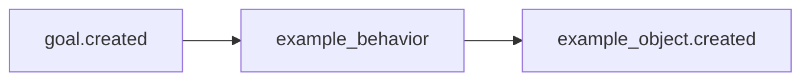

# Template Pack

> Replace this with a one-line description of your pack.

## Overview

Replace this section with a description of:
- What domain this pack covers
- What problem it solves
- What packs it requires and integrates with

## Behavior Map

```
goal.created
  → example_behavior
      creates example_object
```

<!-- Replace with your actual behavior map as a Mermaid diagram: -->
<!--

-->

## Object Types

| Type | Description | Key Fields |
|------|-------------|------------|
| `example_object` | Placeholder object type | `name`, `description`, `metadata` |

## Relation Types

| Relation | Source | Target | Description |
|----------|--------|--------|-------------|
| *(none in template)* | — | — | — |

## Dependencies

```python
requires = []          # Hard dependencies
integrates_with = []   # Optional packs that improve behavior
```

## Usage

```python
from activegraph import Runtime, Graph
from packs.template import pack, TemplateSettings

rt = Runtime(Graph())
rt.load_pack(pack, settings=TemplateSettings())
rt.run_goal("My goal")
```

## Fixtures

See [`fixtures/`](fixtures/) for demo scenarios that run without an LLM or API key.

## CHANGELOG

See [`CHANGELOG.md`](CHANGELOG.md).
