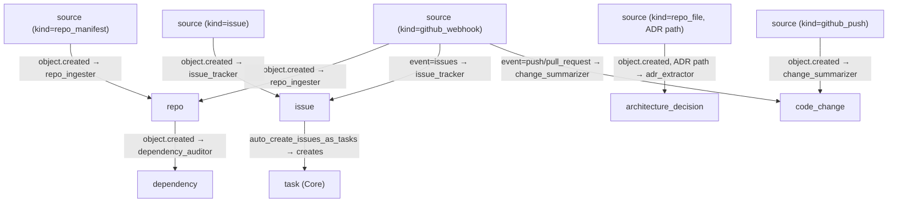

# Codebase Pack — v0.1

Repository, issue, PR, and architecture decision tracking for ActiveGraph.

## Overview

The Codebase Pack provides engineering workflow visibility by ingesting GitHub webhook events, repository manifests, file contents, and structured source objects into a rich graph of code knowledge. It tracks repos, issues, pull requests, architecture decisions, code changes, and dependencies with vulnerability detection.

## Behavior Map



## Object Types

| Name | Description |
|---|---|
| `repo` | Code repository |
| `code_file` | File within a repo |
| `code_function` | Function or method within a file |
| `dependency` | Package dependency with vulnerability tracking |
| `issue` | GitHub/GitLab issue |
| `pull_request` | Pull request |
| `architecture_decision` | Architecture Decision Record (ADR) |
| `code_change` | Commit or PR diff summary |
| `test_result` | Test run result |

## Behaviors

| Name | Trigger | Creates |
|---|---|---|
| `repo_ingester` | `source.created` (kind=`repo_manifest`/`github_webhook`) | `repo` |
| `issue_tracker` | `source.created` (issue event) | `issue`, `task` |
| `adr_extractor` | `source.created` (kind=`repo_file`, ADR path) | `architecture_decision` |
| `change_summarizer` | `source.created` (push/PR webhook) | `code_change` |
| `dependency_auditor` | `repo.created` | `dependency` objects |

## Relation Types

| Name | Source → Target | Description |
|---|---|---|
| `file_in_repo` | code_file → repo | File belongs to repo |
| `function_in_file` | code_function → code_file | Function defined in file |
| `repo_depends_on` | repo → dependency | Declared dependency |
| `issue_in_repo` | issue → repo | Issue belongs to repo |
| `pr_in_repo` | pull_request → repo | PR belongs to repo |
| `adr_in_repo` | architecture_decision → repo | ADR belongs to repo |
| `change_in_repo` | code_change → repo | Change belongs to repo |
| `test_for_repo` | test_result → repo | Test run for repo |
| `derived_from_source` | codebase objects → source | Provenance link |

## Tools

- `ingest_github_webhook` — Ingest a raw GitHub webhook payload
- `ingest_repo_file` — Ingest a repo file (e.g. ADR markdown)
- `create_repo` — Create a repo manifest source
- `create_issue` — Create an issue source

## Quick Start

```python
from activegraph import Runtime, Graph
from packs.core import pack as core_pack, CoreSettings
from packs.codebase import pack as codebase_pack, CodebaseSettings

graph = Graph()
rt = Runtime(graph)
rt.load_pack(core_pack, settings=CoreSettings())
rt.load_pack(codebase_pack, settings=CodebaseSettings(
    auto_create_issues_as_tasks=True,
))

from packs.codebase.tools import create_repo_fn, create_issue_fn
create_repo_fn(graph, full_name="my-org/my-repo", language="python")
rt.run_until_idle()

create_issue_fn(graph, "my-org/my-repo", 1, "Fix null pointer in login flow",
                state="open", labels=["bug"])
rt.run_until_idle()

issues = list(graph.objects(type="issue"))
tasks = list(graph.objects(type="task"))
```

## ADR Detection

Files with paths matching `adr/`, `docs/adr`, `decisions/`, or `doc/arch` are automatically processed as ADRs. Customize via `adr_path_patterns` setting.

## Dependencies

- **Core Pack** (required): `task` created from issues, `observation`
- **Team/Ops Pack** (optional): tasks from issues flow into assignments/milestones
- **Identity Pack** (optional): resolve `author_ref` to `principal` objects

## Running Fixtures

```bash
python packs/codebase/fixtures/run_fixtures.py
```
