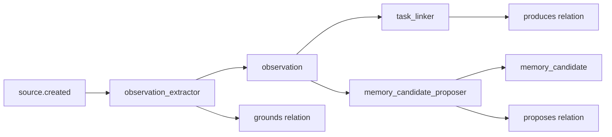

# Core Pack v0.1

> The universal primitive substrate for all ActiveGraph packs.

## Overview

Core Pack defines 7 object types and 7 relation types that form the shared language of the ActiveGraph pack ecosystem. Every domain pack (VC, Research, Codebase, etc.) builds on these primitives.

Core is **deliberately minimal**. It does not include people, companies, claims, evidence, or documents — those belong in domain packs. Adding too much to Core would turn it into a universal ontology, which would conflict with domain packs.

## Behavior Map

```
source.created
  → observation_extractor
      creates observation (up to max_observations_per_source)
      creates grounds(source → observation)

observation.created
  → task_linker
      creates produces(observation → task)  [if text overlap ≥ threshold]

  → memory_candidate_proposer
      creates memory_candidate  [if category ∈ {preference, decision, fact, instruction} AND confidence ≥ 0.7]
      creates proposes(observation → memory_candidate)
```



## Object Types

| Type | Description | Key Fields |
|------|-------------|------------|
| `source` | Something received from the outside world | `kind`, `content`, `url`, `channel`, `sender_ref`, `frame_id` |
| `observation` | A source-grounded thing the system noticed | `text`, `confidence`, `source_ids`, `category`, `frame_id` |
| `task` | A minimal unit of work | `title`, `status` (candidate/active/blocked/done/rejected), `priority`, `source_observation_ids` |
| `action` | A proposed or executed operation | `kind`, `description`, `status`, `proposed_by`, `input_data`, `credential_ref`, `risk_class` |
| `artifact` | A durable output | `kind`, `title`, `content`, `format`, `source_ids`, `task_ids`, `status` |
| `memory_candidate` | Something that might be worth remembering | `text`, `confidence`, `category`, `accepted`, `evaluation_id` |
| `evaluation` | A judgment about any Core object | `subject_id`, `subject_type`, `judgment`, `rationale`, `score` |

### Source Kinds (suggested)
`chat_message`, `email`, `sms`, `call_transcript`, `file`, `url`, `tool_result`, `api_response`, `repo_file`, `meeting_note`, `webhook`

### Observation Categories (suggested)
`intent`, `fact`, `decision`, `question`, `preference`, `action_item`, `risk`, `sentiment`

### Task Statuses
`candidate` → `active` → `done` | `rejected` | `blocked`

### Action Statuses
`proposed` → `authorized` → `executing` → `done` | `failed` | `rejected`

### Artifact Statuses
`draft` → `proposed` → `approved` → `published` | `rejected`

## Relation Types

| Relation | Source → Target | Description |
|----------|-----------------|-------------|
| `grounds` | source → observation | A source grounds an observation |
| `produces` | observation → task/action/artifact/memory_candidate | An observation produces a downstream object |
| `executes` | action → task | An action executes a task |
| `generates` | task/action → artifact | A task or action generates an artifact |
| `proposes` | observation/action → memory_candidate | Proposes something for memory |
| `evaluates` | evaluation → any | An evaluation judges a subject |
| `derived_from` | most types → source/observation/artifact | Provenance tracking |

## Dependencies

```python
requires = []          # No dependencies — Core is the base layer
integrates_with = [
    "memory_gateway",  # Handles memory_candidate acceptance and storage
    "tool_gateway",    # Handles action authorization and execution
]
```

## Usage

```python
from activegraph import Runtime, Graph
from packs.core import pack, CoreSettings

# Minimal setup — no API key needed
rt = Runtime(Graph())
rt.load_pack(pack, settings=CoreSettings())
rt.run_goal("Process: User prefers dark mode.")

# With custom settings
rt = Runtime(Graph())
rt.load_pack(pack, settings=CoreSettings(
    observation_min_confidence=0.6,
    max_observations_per_source=5,
    auto_accept_memory_candidates=False,
))
```

## Running Fixtures

```bash
python packs/core/fixtures/run_fixtures.py
```

No LLM or API key required. Three fixture scenarios:
1. **chat_observation_task** — Chat message → observations → memory candidates
2. **tool_result_source** — Tool result → source → observations
3. **artifact_generation** — Task + source → artifact with relations

## CoreSettings

| Field | Default | Description |
|-------|---------|-------------|
| `observation_min_confidence` | `0.5` | Confidence threshold below which observations are tagged `low_confidence=True` |
| `task_link_similarity_threshold` | `0.6` | Word-overlap ratio for task_linker to create relations |
| `max_observations_per_source` | `10` | Max observations per source object |
| `auto_accept_memory_candidates` | `False` | Auto-accept memory candidates (for standalone demos) |

## Design Invariants

1. **Core stays small** — Never add person, company, claim, evidence, or document here
2. **Observation-first** — Observations are weaker than claims; they record what was noticed
3. **Memory is candidate-first** — Create candidates; let Memory Gateway accept them
4. **No LLM in Core v0.1** — All behaviors are deterministic heuristics
5. **Domain packs bridge to Core** — Map domain objects to source/observation/artifact for auditability

## CHANGELOG

See [`CHANGELOG.md`](CHANGELOG.md).
