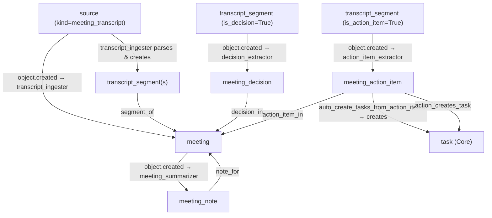

# Meeting Pack — v0.1

Meeting ingestion, transcript processing, decision extraction, and action item creation for ActiveGraph.

## Overview

The Meeting Pack processes meeting transcripts into a structured graph of decisions, action items, and summaries. It handles four transcript formats: JSON (Zoom/Teams/AssemblyAI export), structured `Speaker: text` lines, and plain-text with sentence splitting. Decisions and action items are detected by configurable keyword lists, and Core tasks are automatically created from action items.

## Behavior Map



## Transcript Formats

| Priority | Format | Detection |
|---|---|---|
| 1 | JSON array `[{speaker, text, timestamp}, ...]` | Starts with `[` or `{` |
| 2 | JSON object `{segments: [...]}` / `{utterances: [...]}` | AssemblyAI / Deepgram |
| 3 | Structured text `Speaker: text` | Regex line match |
| 4 | Plain text | Sentence-splitting fallback |

## Object Types

| Name | Description |
|---|---|
| `meeting` | Meeting with participants, platform, and status |
| `transcript_segment` | One speaker turn, flagged for decisions/action items |
| `meeting_decision` | A decision made during a meeting |
| `meeting_action_item` | An action item with a linked Core task |
| `meeting_note` | Meeting summary or notes |

## Behaviors

| Name | Trigger | Creates |
|---|---|---|
| `transcript_ingester` | `source.created` (kind=`meeting_transcript`) | `meeting`, `transcript_segment` |
| `decision_extractor` | `transcript_segment.created` (is_decision=True) | `meeting_decision` |
| `action_item_extractor` | `transcript_segment.created` (is_action_item=True) | `meeting_action_item`, `task` |
| `meeting_summarizer` | `meeting.created` | `meeting_note` |

## Relation Types

| Name | Source → Target | Description |
|---|---|---|
| `segment_of` | transcript_segment → meeting | Segment belongs to meeting |
| `decision_in` | meeting_decision → meeting | Decision made in meeting |
| `action_item_in` | meeting_action_item → meeting | Action item from meeting |
| `note_for` | meeting_note → meeting | Note written for meeting |
| `decision_from_segment` | meeting_decision → transcript_segment | Decision extracted from segment |
| `action_item_from_segment` | meeting_action_item → transcript_segment | Action item from segment |
| `action_creates_task` | meeting_action_item → task | Action item promoted to Core task |
| `derived_from_source` | meeting → source | Meeting derived from transcript source |

## Tools

- `ingest_transcript` — Ingest a meeting transcript (any format)
- `create_meeting` — Create a meeting record without a transcript
- `add_decision` — Manually add a decision to a meeting
- `add_action_item` — Manually add an action item (creates Core task)

## Quick Start

```python
from activegraph import Runtime, Graph
from packs.core import pack as core_pack, CoreSettings
from packs.meeting import pack as meeting_pack, MeetingSettings

graph = Graph()
rt = Runtime(graph)
rt.load_pack(core_pack, settings=CoreSettings())
rt.load_pack(meeting_pack, settings=MeetingSettings(
    auto_create_tasks_from_action_items=True,
))

from packs.meeting.tools import ingest_transcript_fn

# Structured text format
ingest_transcript_fn(
    graph,
    title="Sprint Review",
    content="Alice: We decided to move to PostgreSQL 16.\nBob: I'll write the migration runbook by Friday.",
    date="2026-06-03",
    participants=["Alice", "Bob"],
    platform="zoom",
)

# Or JSON format (Zoom/AssemblyAI)
import json
ingest_transcript_fn(
    graph,
    title="All Hands Q3",
    content=json.dumps([
        {"speaker": "CEO", "text": "We decided to double down on enterprise.", "timestamp": 0.0},
        {"speaker": "CTO", "text": "I'll finalize the roadmap by next week.", "timestamp": 12.5},
    ]),
    date="2026-07-01",
)
rt.run_until_idle()

decisions = list(graph.objects(type="meeting_decision"))
tasks = list(graph.objects(type="task"))
```

## Dependencies

- **Core Pack** (required): `task` from action items, `artifact` for notes
- **Team/Ops Pack** (optional): tasks from action items flow into milestones/assignments
- **Communication Pack** (optional): meeting as a communication channel
- **Identity Pack** (optional): resolve participant refs to `principal` objects

## Running Fixtures

```bash
python packs/meeting/fixtures/run_fixtures.py
```
