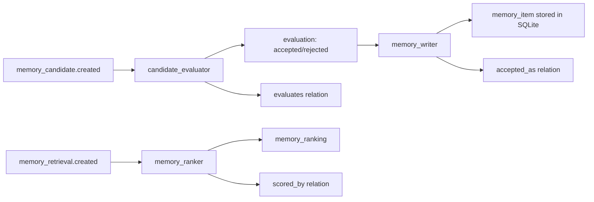

# Memory Gateway Pack v0.1

> Full memory lifecycle management: candidate evaluation, storage, and retrieval.

## Overview

Memory Gateway Pack manages what the assistant remembers. Core Pack only produces `memory_candidate` objects — this pack decides what's worth keeping, stores accepted items, and provides retrieval for contextual memory.

**Design rule:** Never write memory directly. Always create a `memory_candidate` and let Memory Gateway evaluate it.

## Behavior Map

```
memory_candidate.created (from Core Pack)
  → candidate_evaluator
      creates evaluation (judgment=accepted|rejected)
      patches memory_candidate.accepted=True if accepted
      creates evaluates(evaluation → memory_candidate) relation

evaluation.created (judgment=accepted, subject_type=memory_candidate)
  → memory_writer
      creates memory_item (stored in SQLite backend)
      creates accepted_as(memory_candidate → memory_item) relation

memory_retrieval.created
  → memory_ranker
      creates memory_ranking for each item (keyword overlap score)
      creates scored_by(memory_ranking → memory_retrieval) relation
```



## Object Types

| Type | Description | Key Fields |
|------|-------------|------------|
| `memory_item` | A durable stored memory | `text`, `category`, `confidence`, `source_ids`, `candidate_id`, `created_at`, `last_retrieved_at`, `retrieval_count` |
| `memory_retrieval` | Records a retrieval request | `query`, `behavior_name`, `frame_id`, `results_count`, `item_ids`, `retrieved_at` |
| `memory_ranking` | Relevance score for a retrieval result | `retrieval_id`, `item_id`, `score`, `reason`, `rank` |

## Relation Types

| Relation | Source → Target | Description |
|----------|-----------------|-------------|
| `accepted_as` | memory_candidate → memory_item | Promoted candidate |
| `ranked_in` | memory_item → memory_retrieval | Item appears in retrieval |
| `scored_by` | memory_ranking → memory_retrieval | Ranking scores a retrieval |

## Dependencies

```python
requires = ["core"]
integrates_with = ["tool_gateway"]
```

## Backend

Default: **in-memory SQLite** (`:memory:` — no persistence across runs).

For persistence, set `backend_url` to a file path:

```python
MemoryGatewaySettings(backend_url="memory.db")
```

v0.2 will add Postgres/pgvector, Mem0, and Supermemory backends.

## Usage

```python
from activegraph import Runtime, Graph
from packs.core import pack as core_pack, CoreSettings
from packs.memory_gateway import pack as mg_pack, MemoryGatewaySettings
from packs.memory_gateway.tools import retrieve_memories

rt = Runtime(Graph())
rt.load_pack(core_pack, settings=CoreSettings())
rt.load_pack(mg_pack, settings=MemoryGatewaySettings(acceptance_threshold=0.6))

# Create a source — Core's observation_extractor fires, then
# memory_candidate_proposer creates candidates, then
# Memory Gateway's candidate_evaluator accepts/rejects them.
rt.graph.add_object("source", {
    "kind": "chat_message",
    "content": "I always prefer dark mode and sans-serif fonts.",
    "channel": "chat",
})
rt.run_until_idle()

# Retrieve relevant memories for a query
results = retrieve_memories(
    query="user interface preferences",
    top_k=5,
    behavior_name="draft_reply",
)
for r in results:
    print(f"  [{r['score']:.2f}] {r['text']}")
```

## Settings

| Field | Default | Description |
|-------|---------|-------------|
| `acceptance_threshold` | `0.6` | Minimum confidence for candidate acceptance |
| `max_items` | `1000` | Max stored items (LRU eviction when exceeded) |
| `backend_url` | `":memory:"` | SQLite database URL |
| `retrieval_top_k` | `10` | Max results per retrieval |
| `min_retrieval_score` | `0.2` | Minimum similarity score for results |
| `auto_accept_categories` | `["preference", "instruction", "decision"]` | Categories that bypass confidence check |

## Fixtures

```bash
python packs/memory_gateway/fixtures/run_fixtures.py
```

## CHANGELOG

See [`CHANGELOG.md`](CHANGELOG.md).
