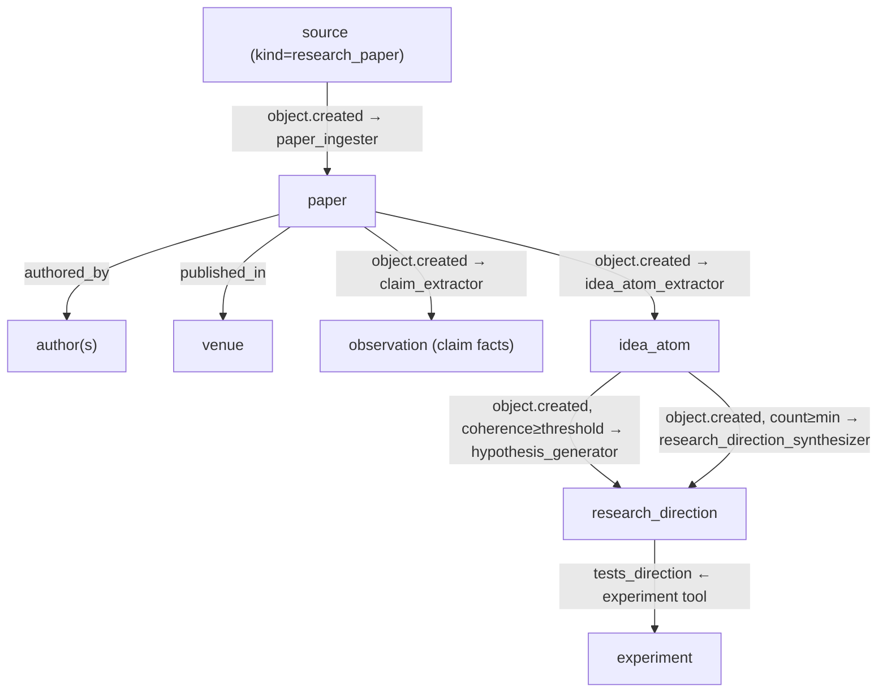

# Research Pack — v0.1

Paper/claim/method/idea discovery and hypothesis generation for ActiveGraph.

## Overview

The Research Pack provides a complete knowledge graph layer for academic and applied research workflows. It ingests research papers from structured sources, extracts claims as observations, distills atomic research ideas, and synthesizes research directions from converging idea atoms.

All behaviors in v0.1 use deterministic mock stubs — no LLM API key required.

## Behavior Map



## Object Types

| Name | Description |
|---|---|
| `paper` | Research paper with title, abstract, authors, venue, keywords |
| `author` | Research author with affiliation and paper list |
| `venue` | Publication venue: journal, conference, workshop, preprint |
| `method` | Research method or algorithm referenced in papers |
| `benchmark` | Benchmark task with SOTA metric tracking |
| `dataset` | Research dataset referenced in papers |
| `idea_atom` | Atomic research idea distilled from one or more papers |
| `research_direction` | Synthesized direction from multiple idea atoms |
| `experiment` | Proposed or running research experiment |

## Behaviors

| Name | Trigger | Creates |
|---|---|---|
| `paper_ingester` | `source.created` (kind=`research_paper`) | `paper`, `author`, `venue` |
| `claim_extractor` | `paper.created` | `observation` (claim sentences) |
| `idea_atom_extractor` | `paper.created` | `idea_atom` |
| `hypothesis_generator` | `idea_atom.created` (coherence ≥ threshold) | `research_direction` |
| `research_direction_synthesizer` | `idea_atom.created` (count ≥ min) | `research_direction` (cross-paper synthesis) |

## Relation Types

| Name | Source → Target | Description |
|---|---|---|
| `cites` | paper → paper | Citation |
| `authored_by` | paper → author | Authorship |
| `published_in` | paper → venue | Publication venue |
| `uses_method` | paper → method | Method reference |
| `reports_benchmark` | paper → benchmark | Benchmark result |
| `uses_dataset` | paper → dataset | Dataset reference |
| `proposes_idea` | paper → idea_atom | Idea extracted from paper |
| `composes_direction` | idea_atom → research_direction | Atom contributes to direction |
| `tests_direction` | experiment → research_direction | Experiment tests a direction |
| `derived_from_source` | paper → source | Paper derived from source |

## Tools

- `ingest_research_paper` — Create a research paper source
- `create_idea_atom` — Directly create an idea atom
- `create_experiment` — Create a research experiment linked to a direction

## Quick Start

```python
from activegraph import Runtime, Graph
from packs.core import pack as core_pack, CoreSettings
from packs.research import pack as research_pack, ResearchSettings

graph = Graph()
rt = Runtime(graph)
rt.load_pack(core_pack, settings=CoreSettings())
rt.load_pack(research_pack, settings=ResearchSettings(
    min_coherence_for_hypothesis=0.5,
    max_ideas_per_paper=5,
))

from packs.research.tools import ingest_research_paper_fn
ingest_research_paper_fn(
    graph,
    title="Attention Is All You Need",
    abstract="We propose the Transformer architecture...",
    authors="Vaswani et al.",
    venue="NeurIPS 2017",
    year=2017,
    keywords=["attention", "transformer"],
)
rt.run_until_idle()

papers = list(graph.objects(type="paper"))
ideas = list(graph.objects(type="idea_atom"))
directions = list(graph.objects(type="research_direction"))
```

## Dependencies

- **Core Pack** (required): `observation`, `task`, `artifact`, `memory_candidate`
- **Entity Pack** (optional): resolve author names to canonical `entity` objects
- **Memory Gateway Pack** (optional): promote research claims to durable memory

## Running Fixtures

```bash
python packs/research/fixtures/run_fixtures.py
```
