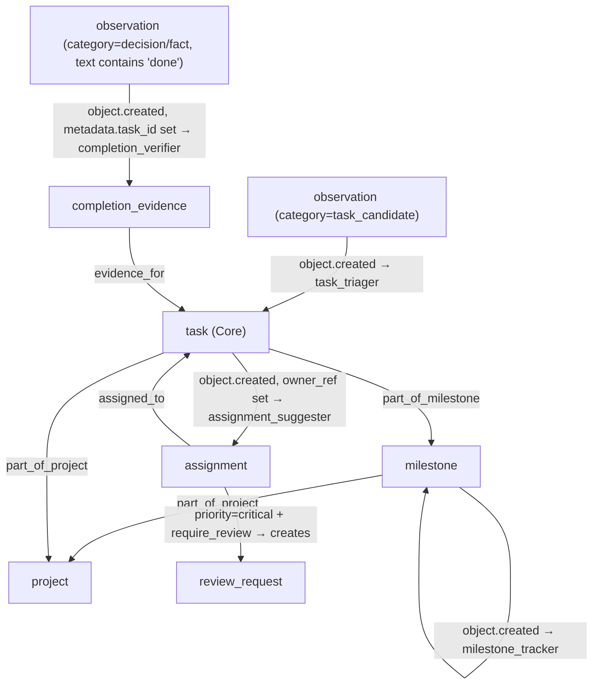

# Team/Ops Pack — v0.1

Project management layer extending Core tasks with assignments, milestones, and workload tracking.

## Overview

The Team/Ops Pack extends the Core Pack's task primitive with project management capabilities. It provides project and milestone organization, task assignment, workload estimation, completion verification, and review requests. It deliberately does **not** replace Core tasks — it wraps them via relations.

## Design Principle

```
Core task  ←─ assigned_to ─── Assignment (Team/Ops)
Core task  ←─ part_of_milestone ─── Milestone (Team/Ops)
Core task  ←─ part_of_milestone, part_of_project ─── Project (Team/Ops)
Core task  ←─ evidence_for ─── CompletionEvidence (Team/Ops)
```

## Behavior Map



## Object Types

| Name | Description |
|---|---|
| `project` | Project grouping tasks and milestones |
| `assignment` | Task-to-principal assignment record |
| `milestone` | Milestone grouping tasks with a target date |
| `workload_estimate` | Estimated workload per person per period |
| `completion_evidence` | Evidence that a task was completed |
| `review_request` | Review/approval request for a task |

## Behaviors

| Name | Trigger | Creates |
|---|---|---|
| `task_triager` | `observation.created` (task_candidate) | `task`, `assignment` |
| `assignment_suggester` | `task.created` (owner_ref set) | `assignment` |
| `milestone_tracker` | `milestone.created` | *(updates registry)* |
| `completion_verifier` | `observation.created` (done/completed, metadata.task_id) | `completion_evidence` |

## Relation Types

| Name | Source → Target | Description |
|---|---|---|
| `assigned_to` | assignment → task | Assignment links to the Core task |
| `depends_on` | task → task | Task dependency |
| `part_of_milestone` | task → milestone | Task is in a milestone |
| `part_of_project` | task/milestone → project | Part of a project |
| `evidence_for` | completion_evidence → task | Evidence for task completion |
| `review_of` | review_request → task | Review request for a task |
| `workload_for` | workload_estimate → assignment | Workload associated with assignment |

## Tools

- `create_project` — Create a project
- `create_milestone` — Create a milestone within a project
- `submit_task_candidate` — Submit a task_candidate observation for triage
- `assign_task` — Assign a task to a team member
- `mark_task_done` — Mark a task as done with completion evidence

## Quick Start

```python
from activegraph import Runtime, Graph
from packs.core import pack as core_pack, CoreSettings
from packs.team_ops import pack as team_ops_pack, TeamOpsSettings

graph = Graph()
rt = Runtime(graph)
rt.load_pack(core_pack, settings=CoreSettings())
rt.load_pack(team_ops_pack, settings=TeamOpsSettings(auto_assign_tasks=True))

from packs.team_ops.tools import create_project_fn, submit_task_candidate_fn
project = create_project_fn(graph, "Q3 Infrastructure", goal="Reduce latency by 30%")
rt.run_until_idle()

submit_task_candidate_fn(
    graph,
    text="Optimize database indexes assigned to alice@acme.com",
    owner_ref="alice@acme.com",
    project_id=project.id,
    priority="high",
)
rt.run_until_idle()

tasks = list(graph.objects(type="task"))
assignments = list(graph.objects(type="assignment"))
```

## Dependencies

- **Core Pack** (required): `task`, `observation`
- **Meeting Pack** (optional): action items from meetings become tasks
- **Codebase Pack** (optional): GitHub issues become tasks
- **Identity Pack** (optional): resolve `principal_ref` to `principal`

## Running Fixtures

```bash
python packs/team_ops/fixtures/run_fixtures.py
```
