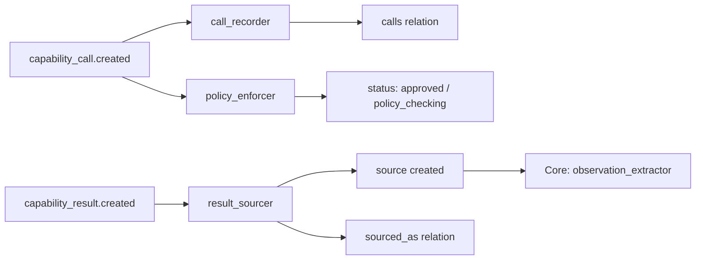

# Tool Gateway Pack v0.1

> The capability execution gateway. All external calls flow through here.

## Overview

Tool Gateway Pack ensures every external capability call (API, local function, MCP server, SDK) is:
- **Policy-checked** before execution (risk class vs. auto-approve list)
- **Graph-visible** (CapabilityCall and CapabilityResult as graph objects)
- **Auditable** (full call record with inputs, outputs, timestamps)
- **Bridged to Core** (results become Core `source` objects for observation extraction)

Secrets never enter model context — `credential_ref_name` is a name reference only.

## Behavior Map

```
capability_call.created (status=proposed)
  → call_recorder
      creates calls(capability_call → capability_provider) relation

  → policy_enforcer
      patches capability_call.status → "approved" | "policy_checking"

capability_result.created
  → result_sourcer
      creates source (kind=tool_result)
      creates sourced_as(capability_result → source) relation
      [Core Pack observation_extractor then fires on source.created]
```



## Object Types

| Type | Description | Key Fields |
|------|-------------|------------|
| `capability_provider` | Registered external capability provider | `name`, `kind` (local/api/mcp/sdk/webhook), `base_url`, `capabilities`, `credential_ref_name` |
| `capability_call` | A proposed or executing capability call | `provider_id`, `capability_name`, `input_data`, `credential_ref_name`, `risk_class`, `status` |
| `capability_result` | The result of an executed call | `call_id`, `output_data`, `error`, `success`, `executed_at`, `source_id` |

### CapabilityCall Status Lifecycle
`proposed` → `policy_checking` | `approved` → `executing` → `done` | `failed` | `rejected`

### Risk Classes
- `low` — read-only, safe, no side effects
- `medium` — writes to external systems
- `high` — financial or legal consequences
- `critical` — irreversible (delete, send payment)

## Relation Types

| Relation | Source → Target | Description |
|----------|-----------------|-------------|
| `calls` | capability_call → capability_provider | Which provider the call targets |
| `produces_result` | capability_call → capability_result | Execution result |
| `sourced_as` | capability_result → source | Bridge to Core Pack for observation extraction |

## Dependencies

```python
requires = ["core"]
integrates_with = ["secrets"]  # For credential reference resolution
```

## Usage

```python
from activegraph import Runtime, Graph
from packs.core import pack as core_pack
from packs.tool_gateway import pack as tg_pack, ToolGatewaySettings
from packs.tool_gateway.tools import register_local_capability, execute_capability

# Register a local capability
def lookup_company(company_name: str) -> dict:
    return {"name": company_name, "founded": 2021, "arr": "$2M"}

register_local_capability("crm", "lookup_company", lookup_company)

# Load packs
rt = Runtime(Graph())
rt.load_pack(core_pack)
rt.load_pack(tg_pack, settings=ToolGatewaySettings(
    auto_approve_risk_classes=["low", "medium"],
))

# Create a CapabilityCall (policy_enforcer auto-approves low-risk calls)
call = rt.graph.add_object("capability_call", {
    "provider_id": "prov#1",
    "provider_name": "CRM",
    "capability_name": "lookup_company",
    "input_data": {"company_name": "Northwind Robotics"},
    "risk_class": "low",
    "status": "proposed",
})
rt.run_until_idle()  # policy_enforcer approves it

# Execute the approved call
result_data = execute_capability(
    provider_name="crm",
    capability_name="lookup_company",
    input_data={"company_name": "Northwind Robotics"},
    call_id=call.id,
)

# Record result (triggers result_sourcer → Core observation_extractor)
rt.graph.add_object("capability_result", {
    "call_id": call.id,
    "provider_name": "CRM",
    "capability_name": "lookup_company",
    "output_data": result_data["output_data"],
    "success": result_data["success"],
    "executed_at": result_data["executed_at"],
})
rt.run_until_idle()
```

## Settings

| Field | Default | Description |
|-------|---------|-------------|
| `auto_approve_risk_classes` | `["low"]` | Risk classes auto-approved without human review |
| `record_input_data` | `True` | Record input params in CapabilityCall |
| `record_output_data` | `True` | Record output in CapabilityResult |
| `max_output_chars` | `10000` | Max chars stored in output_data |
| `create_source_from_result` | `True` | Create Core source from each result |

## Fixtures

```bash
python packs/tool_gateway/fixtures/run_fixtures.py
```

## CHANGELOG

See [`CHANGELOG.md`](CHANGELOG.md).
