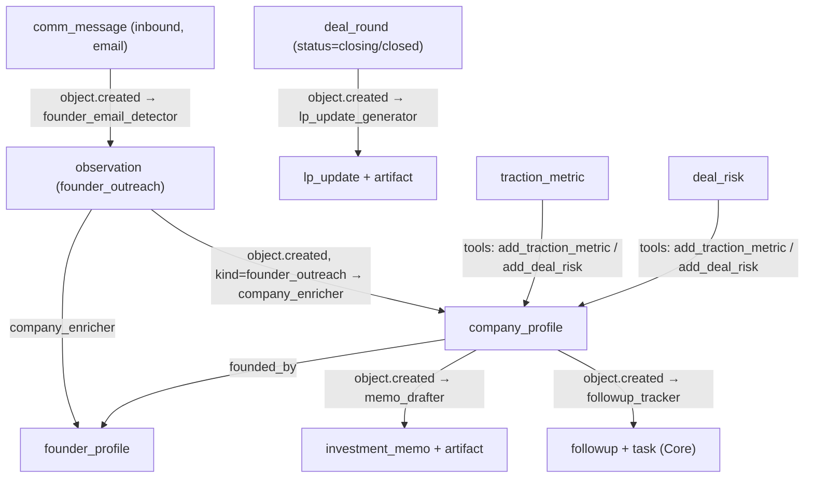

# VC Pack — v0.1

Founder relationship management, deal tracking, and investment memo generation for ActiveGraph.

## Overview

The VC Pack provides a complete deal flow layer for venture capital workflows. It detects founder fundraising outreach from emails, enriches company and founder profiles, drafts preliminary investment memos, tracks follow-ups, and generates LP updates when notable deal milestones occur.

All behaviors in v0.1 use deterministic mock stubs — no LLM API key required.

## Behavior Map



## Object Types

| Name | Description |
|---|---|
| `company_profile` | Startup being evaluated for investment |
| `founder_profile` | Founder associated with a company |
| `deal_round` | Fundraising round under evaluation |
| `traction_metric` | Business metric (ARR, MRR, DAU, NPS, etc.) |
| `investment_memo` | Structured investment memorandum |
| `investment_thesis` | The fund's investment thesis |
| `deal_risk` | Risk identified during evaluation |
| `followup` | Follow-up action for a company |
| `lp_update` | Portfolio update for limited partners |

## Behaviors

| Name | Trigger | Creates |
|---|---|---|
| `founder_email_detector` | `comm_message.created` (inbound email) | `observation` (founder_outreach) |
| `company_enricher` | `observation.created` (founder_outreach) | `company_profile`, `founder_profile` |
| `memo_drafter` | `company_profile.created` | `investment_memo`, `artifact` |
| `followup_tracker` | `company_profile.created` | `followup`, `task` |
| `lp_update_generator` | `deal_round.created` (status: term_sheet/closing/closed) | `lp_update`, `artifact` |

## Relation Types

| Name | Source → Target | Description |
|---|---|---|
| `founded_by` | company_profile → founder_profile | Founding relationship |
| `raised_in` | company_profile → deal_round | Active fundraising round |
| `reports_metric` | company_profile → traction_metric | Metric reported by company |
| `memo_for` | investment_memo → company_profile | Memo written for a company |
| `risk_in` | deal_risk → company_profile | Risk for this company |
| `followup_for` | followup → company_profile | Follow-up for this company |
| `founder_outreach_source` | founder_profile → source | Source of founder discovery |
| `derived_from_comm` | company_profile/founder_profile → source | Profile derived from comm source |

## Tools

- `ingest_founder_email` — Ingest a founder email as a `comm_message`
- `create_deal_round` — Create a deal round for a company
- `add_traction_metric` — Record ARR, MRR, DAU, or any business metric
- `add_deal_risk` — Record a risk identified during evaluation

## Quick Start

```python
from activegraph import Runtime, Graph
from packs.core import pack as core_pack, CoreSettings
from packs.communication import pack as comm_pack
from packs.vc import pack as vc_pack, VCSettings

graph = Graph()
rt = Runtime(graph)
rt.load_pack(core_pack, settings=CoreSettings())
rt.load_pack(comm_pack)
rt.load_pack(vc_pack, settings=VCSettings(
    owner_firm_name="Benchmark Capital",
    auto_draft_memo=True,
))

from packs.vc.tools import ingest_founder_email_fn
ingest_founder_email_fn(
    graph,
    sender_ref="founder@startup.io",
    content="We're raising our seed round at $5M. ARR is $800k, 30% MoM growth...",
    subject="Startup — Seed Round",
)
rt.run_until_idle()

companies = list(graph.objects(type="company_profile"))
memos = list(graph.objects(type="investment_memo"))
```

## Dependencies

- **Core Pack** (required): `task` for follow-ups, `artifact` for memos, `observation`
- **Communication Pack** (required): provides `comm_message` object type
- **Entity Pack** (optional): resolve founder names to canonical `entity` objects
- **Identity Pack** (optional): link `founder_profile` to a `principal`

## Running Fixtures

```bash
python packs/vc/fixtures/run_fixtures.py
```
